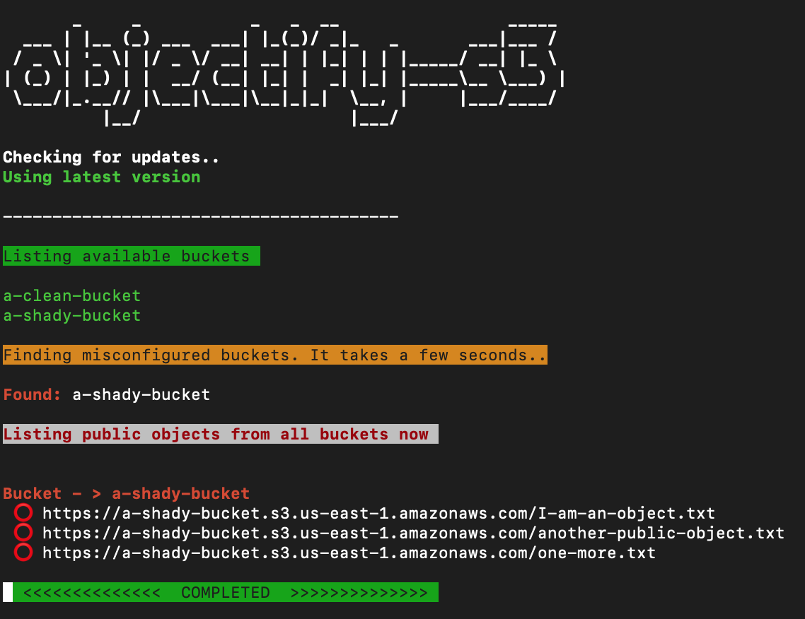

[](https://twitter.com/0xGaurav)

# objectify-s3
Objectify-s3 is a fully automated scanner that recursively scans all AWS S3 buckets and objects in your AWS account for misconfigured permissions. Unlike most S3 auditing tools that only show bucket policy misconfigurations, this one checks object level ACLs as well, recursively. <br>

# Requirements
1. [Ruby](https://www.ruby-lang.org/en/documentation/installation/) (Comes installed by default with Mac and most Linux distributions)
2. [awscli](https://docs.aws.amazon.com/cli/latest/userguide/getting-started-install.html) (Objectify-s3 will install, if not found)
3. [Git](https://git-scm.com/book/en/v2/Getting-Started-Installing-Git) (Comes installed by default with all Mac and linux distributions)

# Installation
- Remove previous installation, if any
```
rm -rf ~/objectify-s3
```

- Then, Use this one liner
```
cd ~; git clone https://github.com/emgaurav/objectify-s3.git; cd objectify-s3; bash setup.sh
```
- Finally, Run `source ~/.bashrc` or `source ~/.zshrc` depending on your shell type to source the alias. Alternatively, you can close and reopen your terminal window.


# Usage
- To run a fully automated scan
```
objectify-s3
```
- To provide your file of buckets list
```
objectify-s3 -r /full/path/to/file.txt
```
_Note: You must provide the full path to file even if it is in your current directory_<br>
_`objectify-s3` runs with 'default' aws credentials profile. Custom profiles are not supported yet._

**Press  _Ctrl_ + \\  to skip finding objects from current bucket or directory** <br>

# Sample Output



# Requirements
1. [Ruby](https://www.ruby-lang.org/en/documentation/installation/)
2. [awscli](https://docs.aws.amazon.com/cli/latest/userguide/getting-started-install.html)
3. [Git](https://git-scm.com/book/en/v2/Getting-Started-Installing-Git)

# Installation
- Remove previous installation, if any
```
rm -rf ~/objectify-s3
```

- Then, Use this one liner
```
cd ~; git clone https://github.com/emgaurav/objectify-s3.git; cd objectify-s3; bash setup.sh
```
- Finally, Run `source ~/.bashrc` or `source ~/.zshrc` depending on your shell type to source the alias. Alternatively, you can close and reopen your terminal window.

# Supported Platforms
1. Linux
2. MAC

# Credits/References
https://faraday.ai/blog/finding-public-s3-objects/
